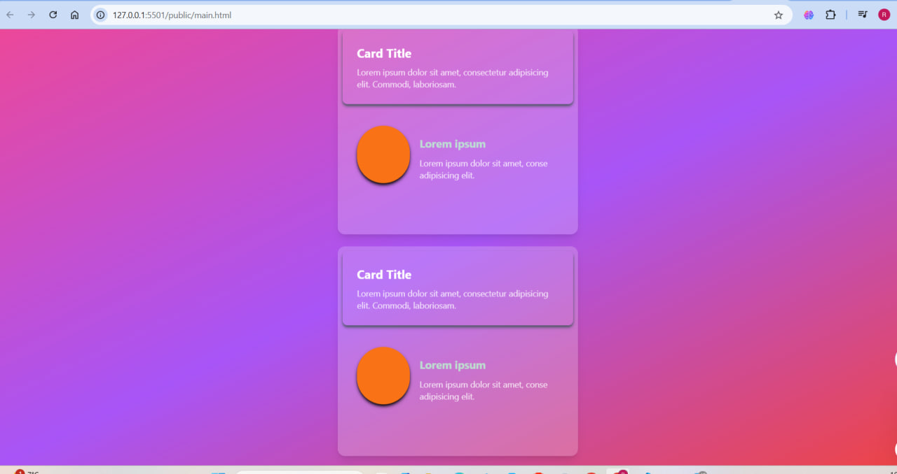

# Vrit-Task-A

## Card Stack Design

A visually appealing card stack design built using **HTML**, **CSS**, **javascript** and **Tailwind CSS**. The project demonstrates a dynamic card animation with a gradient background and stylish card layouts.

---

### Features
- Fully responsive design using **Tailwind CSS**.
- Gradient background using Tailwind's `bg-gradient-to-br` utility.
- Smooth card animations implemented with CSS keyframes.

---

### Technologies Used
1. **HTML** - For structuring the content.
2. **CSS Keyframes** - For creating smooth animations.
3. **Tailwind CSS** - For styling and responsiveness.

---

### Setup Instructions

#### Prerequisites
Ensure that you have **Node.js** and **npm** installed. This is required to set up Tailwind CSS.

#### Steps
1. Clone the repository:
   ```bash
   git clone <repository_url>
   cd <repository_folder>
   ```

2. Install Tailwind CSS:
  This is the link for installing tailwind css. https://tailwindcss.com/docs/installation


3. Open `main.html` in your browser to view the design.

---

### Usage
1. The cards are animated with a sliding effect. You can customize the animation by editing the `@keyframes` in the `<style>` tag.
2. Adjust the gradient background using Tailwind's `bg-gradient-to-br` class.


## Screenshot

---

### License
This project is licensed under the MIT License. Feel free to use, modify, and distribute it as needed.

---

Let me know if you need further assistance or additional customization!